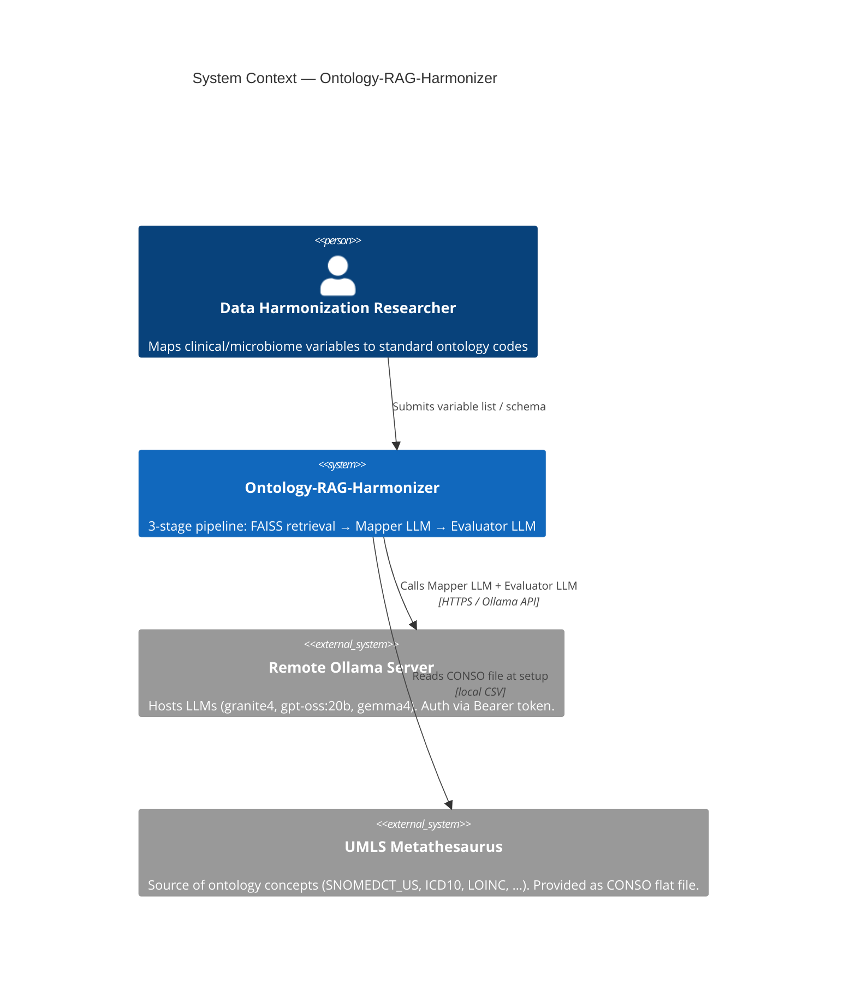
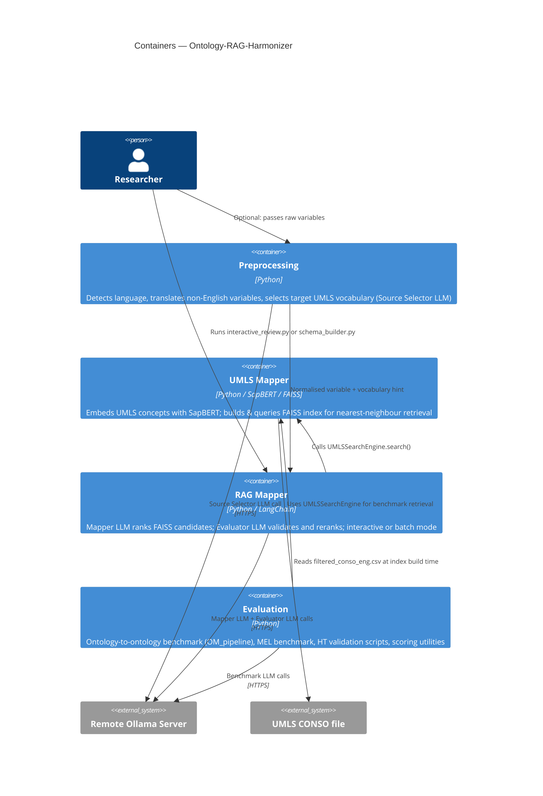
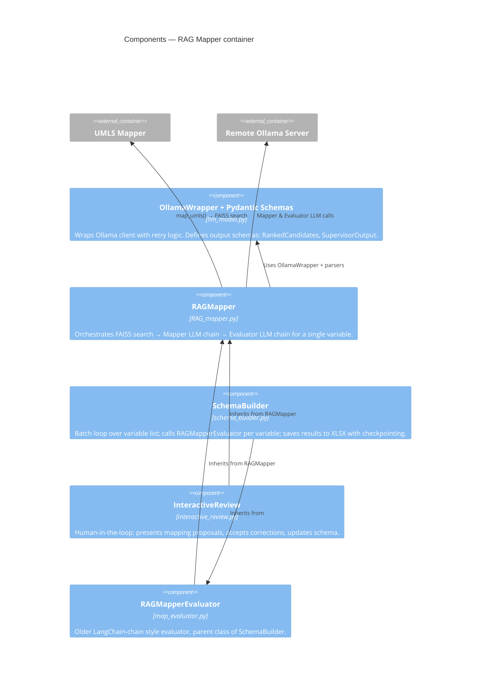
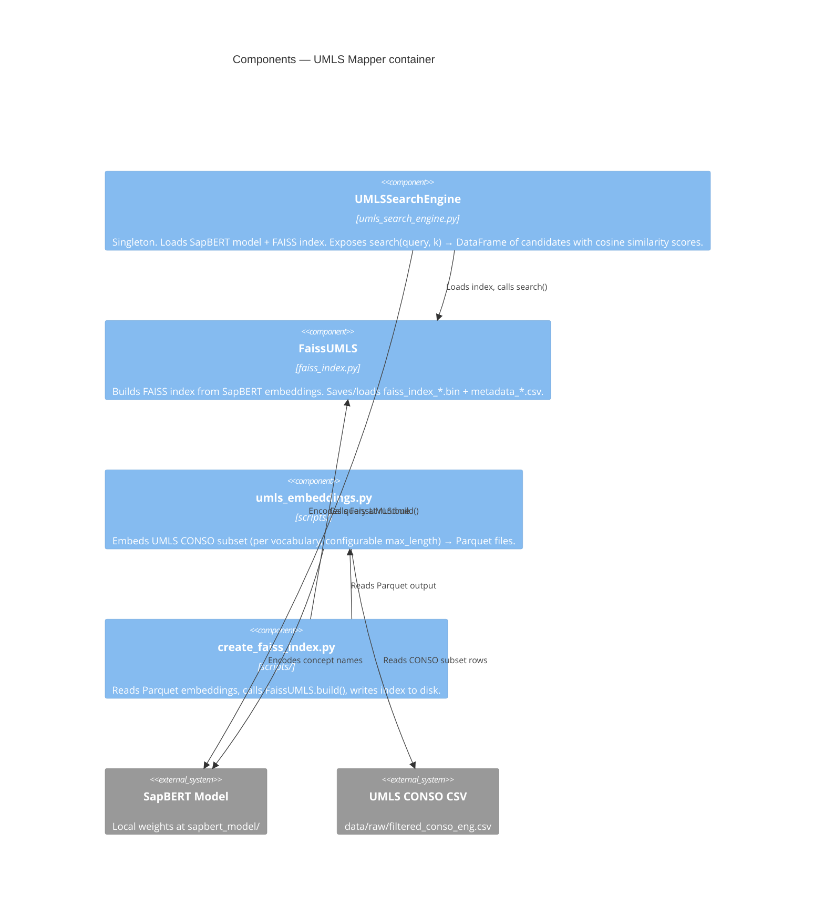
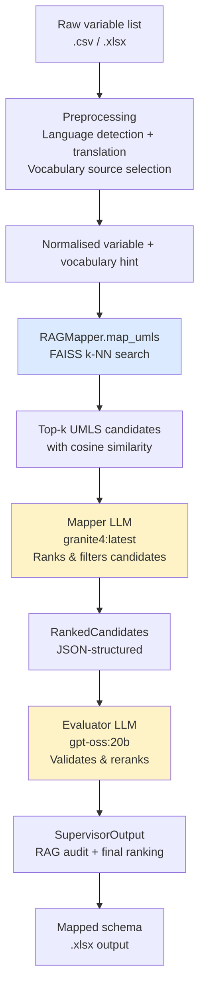

# Ontology-RAG-Harmonizer — C4 Architecture

## Level 1: System Context

---

## Level 2: Container Diagram

---

## Level 3: Component Diagram — RAG Mapper

---

## Level 3: Component Diagram — UMLS Mapper

---

## Data / Artifact Flow (end-to-end)

